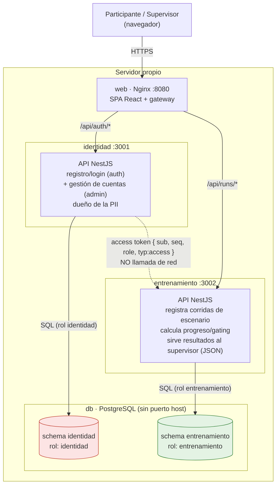
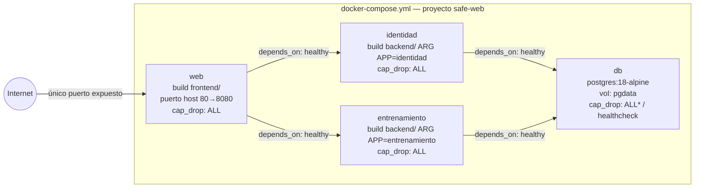

# Diagramas de arquitectura y datos

Complementa a `docs/ARQUITECTURA.md` (documento normativo). Estos diagramas
son una vista visual del mismo sistema — si describen algo distinto a lo que
dice ARQUITECTURA.md, ese documento manda y este se actualiza.

---

## 1. Arquitectura de contenedores

Dos microservicios cortados por sensibilidad del dato, detrás de un único
gateway. Los servicios nunca se llaman entre sí; todo lo que comparten viaja
en el JWT.



**Qué hace cada microservicio**

- **`identidad`** (`/api/auth/*`, `/api/admin/*`): registro, login, refresco de
  sesión (`POST /auth/refresh`), `me`, y gestión de cuentas de participante
  por el supervisor (listar, activar/desactivar, restablecer contraseña,
  eliminar). Es el único que conoce nombre, apellido, correo, cédula
  (hasheada) y contraseña, y el único que ve un refresh token —
  `entrenamiento` solo verifica access tokens.
- **`entrenamiento`** (`/api/runs/*`): no es "entrenamiento" de un modelo de
  IA — es el módulo de *práctica/entrenamiento del participante* dentro del
  estudio. Registra cada corrida de escenario (`POST /runs`), calcula el
  progreso/gating por módulo (`GET /runs/progreso/:modulo`), devuelve las
  corridas propias (`GET /runs/me`) y arma la vista de resultados
  seudonimizados para el supervisor (`GET /runs/resultados`, JSON, **no
  CSV**). Nunca ve un dato personal: solo `participantId` (uuid opaco) y
  `seq`, los dos tomados del JWT.

Reglas que el diagrama no puede mostrar por sí solo (ver ARQUITECTURA.md §2):

- `db`, `identidad` y `entrenamiento` **no publican puertos al host**; solo
  `web` es alcanzable desde afuera.
- El rol `entrenamiento` no tiene permiso sobre el schema `identidad`, ni al
  revés. `permission denied for schema identidad` si se intenta.
- No hay llamada `identidad → entrenamiento` ni viceversa: la línea punteada
  es el JWT viajando *a través del navegador*, no una llamada de red directa.

---

## 2. Despliegue (Docker Compose)



Una sola imagen de backend sirve a los dos servicios (`ARG APP` decide qué
migraciones y qué `main.js` arrancan). `db-init/01-roles-y-schemas.sh` crea
los roles y schemas solo la primera vez que se inicializa el volumen
`pgdata`.

---

## 3. Flujo de una corrida (registro → resultados)

Ilustra por qué la vista de resultados no puede llevar datos personales: no
es una regla de disciplina, es que `entrenamiento` nunca ve la tabla
`Participant`.

```mermaid
sequenceDiagram
    participant P as Participante
    participant S as Supervisor
    participant N as Nginx (web)
    participant I as identidad :3001
    participant DI as schema identidad
    participant E as entrenamiento :3002
    participant DE as schema entrenamiento

    P->>N: POST /api/auth/register {nombre, apellido, email, cedula, password}
    N->>I: proxy /api/auth/*
    I->>I: valida cédula (módulo 10), hashea (bcrypt/HMAC)
    I->>DI: INSERT Participant
    I-->>P: { accessToken (15 min, typ:access), participant }<br/>+ Set-Cookie: mic-refresh-token (httpOnly, 12h, typ:refresh)
    Note over P,I: El refresh token nunca llega a JS: accessToken se guarda<br/>en localStorage, la cookie la maneja el navegador solo.

    P->>N: POST /api/runs {scenarioId, outcome, decisions...} + accessToken
    N->>E: proxy /api/runs/*
    E->>E: extrae participantId/seq del JWT (no del body)
    E->>DE: INSERT ScenarioRun
    E-->>P: 201 Created

    Note over I,E: Ninguna llamada de red entre I y E.<br/>Todo lo necesario viaja en el access token.

    Note over P,I: --- 15 min después: el access token vence ---
    P->>N: POST /api/auth/refresh (sin body, cookie automática)
    N->>I: proxy /api/auth/*
    I->>I: verifica typ:refresh de la cookie (typ:access aquí → 401)
    I->>DI: SELECT Participant (relee role, disabledAt)
    I-->>P: nuevo { accessToken, participant } + Set-Cookie rotada
    Note over I,P: Falla (inválido/vencido/cuenta desactivada) → 401 y borra la cookie.<br/>El cambio de rol/estado tarda como máximo lo que dura un access token.

    P->>N: POST /api/auth/logout (al cerrar sesión)
    N->>I: proxy /api/auth/*
    I-->>P: 204 + Set-Cookie vacía (borra mic-refresh-token)
    Note over P,I: JS no puede borrar una cookie httpOnly por su cuenta;<br/>por eso existe esta ruta.

    S->>N: GET /api/runs/resultados + JWT (role: SUPERVISOR)
    N->>E: proxy /api/runs/*, SupervisorGuard
    E->>DE: SELECT * FROM ScenarioRun ORDER BY participantSeq, finishedAt
    E-->>S: JSON [{ seudonimo: "P001", scenarioId, outcome, score... }]
    Note over E,S: Se ve dentro de la app, no se descarga.<br/>Nunca hay `join` con Participant: no existe el camino.

    S->>N: GET /api/admin/participantes + JWT (role: SUPERVISOR)
    N->>I: proxy /api/admin/*, SupervisorGuard
    I->>DI: SELECT id, seq, email, disabledAt... FROM Participant
    I-->>S: JSON — gestión de cuentas (activar/desactivar, reset password, eliminar)
```

---

## 4. Diagrama entidad-relación

Un schema de Postgres por servicio, **una tabla por schema**, sin llave
foránea entre ellas — a propósito (ver ARQUITECTURA.md §2.1 y §6).

Código en **DBML** (dbdiagram.io) — pegar en https://dbdiagram.io/d para
verlo. Dos `Table` sin `Ref` entre ellas a propósito: no hay FK porque no
debe haberla.

```dbml
Project safe_web {
  database_type: 'PostgreSQL'
  note: 'Un Postgres, dos schemas, dos roles. Sin FK entre ellos: el puente es el JWT, no SQL.'
}

Enum identidad.role_enum {
  PARTICIPANT
  SUPERVISOR
}

Enum entrenamiento.run_outcome {
  CORRECTO
  PARCIAL
  INCORRECTO
}

Table identidad.Participant {
  id                  uuid      [pk, default: `gen_random_uuid()`]
  seq                 int       [unique, increment, note: 'origen del seudónimo P001, viaja en el JWT']
  nombre              varchar   [not null]
  apellido            varchar   [not null]
  email               varchar   [unique, not null, note: 'usuario de login']
  cedulaHash          varchar   [unique, note: 'nullable —solo el supervisor no tiene—, HMAC-SHA256, la cédula en claro nunca se guarda']
  passwordHash        varchar   [not null, note: 'bcrypt factor 12']
  role                role_enum [not null, default: 'PARTICIPANT']
  onboardingVistoAt   timestamp [note: 'nullable']
  disabledAt          timestamp [note: 'nullable, cuenta desactivada por supervisor']
  createdAt           timestamp [not null, default: `now()`]

  Note: 'Único dueño de datos personales. Rol de Postgres "identidad", sin permiso sobre el schema entrenamiento. El anonimato del dato de análisis lo da la separación estructural, no un borrado posterior sobre esta tabla.'
}

Table entrenamiento.ScenarioRun {
  id                  uuid       [pk, default: `gen_random_uuid()`]
  participantId       uuid       [not null, note: 'uuid opaco tomado del JWT — SIN FK a propósito']
  participantSeq      int        [not null, note: 'del JWT, para derivar el seudónimo sin consultar a identidad']
  scenarioId          varchar    [not null, note: 'seccionId/escenarioId del catálogo']
  version             int        [not null, default: 1]
  outcome             run_outcome [not null]
  score               int        [not null, note: '0-100']
  endingId            varchar    [not null]
  durationMs          int        [not null]
  decisions           json       [not null, default: '[]', note: 'traza libre, forma distinta por escenario']
  startedAt           timestamp  [not null]
  finishedAt          timestamp  [not null, default: `now()`]

  indexes {
    (participantId, scenarioId, finishedAt) [name: 'idx_gating']
    scenarioId [name: 'idx_scenario']
  }

  Note: 'Datos del estudio. Rol de Postgres "entrenamiento", sin permiso sobre el schema identidad. Cero columnas de PII.'
}

// Deliberadamente NO existe:
// Ref: entrenamiento.ScenarioRun.participantId > identidad.Participant.id
// El puente entre las dos tablas es el JWT { sub, seq }, no SQL.
```

**Por qué no hay FK:** `entrenamiento` guarda `participantId` como uuid
opaco copiado del JWT. El servicio no tiene la tabla `Participant`, no tiene
permiso sobre su schema, y por lo tanto **no puede** resolver ni filtrar un
dato personal — ni por error. El anonimato del dato de análisis lo da esta
separación, continua desde el primer registro; no depende de un borrado
posterior sobre `Participant`.

| | `identidad.Participant` | `entrenamiento.ScenarioRun` |
|---|---|---|
| Motor | PostgreSQL, schema `identidad` | PostgreSQL, schema `entrenamiento` |
| Rol de Postgres | `identidad` (sin acceso a `entrenamiento`) | `entrenamiento` (sin acceso a `identidad`) |
| Filas | 1 por participante | 1 por escenario terminado |
| PII | sí | no, nunca |
